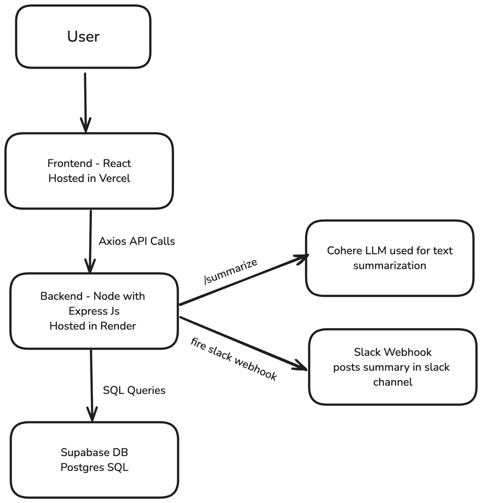

# 🧠 AI-Powered Todo Summarizer

A full-stack AI-enhanced todo management app. Add, edit, and complete tasks — then generate a smart summary of all pending todos powered by **Cohere’s LLM**. The summary is also sent to a Slack channel for better team updates.

## 🌐 Live Demo

🔗 [https://leucine-task.vercel.app/](https://leucine-task.vercel.app/)

---

## 📂 Project Structure

- `frontend/`: React UI built with Tailwind CSS and Axios.
- `backend/`: Express server with Supabase integration, Cohere summarization, and Slack notification.

---

## 📐 System Architecture

This diagram shows how your React frontend, Node backend, Supabase, Cohere, and Slack all interact:



---

## 🖥 Frontend Setup

Navigate to the `frontend/` directory to run the app locally.

### ⚙️ Steps to Run Locally:

```bash
cd frontend
npm install
npm run dev
```
## 🛠 Backend Setup
Navigate to the backend/ directory to start the server.

### ⚙️ Steps to Run Locally:
```bash
cd backend
npm install
npm start
```
Ensure Supabase and Slack are configured before starting.

### 🔑 Environment Variables
Create a .env file in the backend/ folder:

``` env
PORT=5000
SUPABASE_URL=https://your-project.supabase.co
SUPABASE_KEY=your_supabase_service_role_key
COHERE_API_KEY=your_cohere_api_key
SLACK_WEBHOOK_URL=https://hooks.slack.com/services/xxx/yyy/zzz
```
## ✨ Features
- 📝 Add, update, and delete todos

- ✅ Mark todos as completed

- 🧠 Generate natural language summaries of pending todos using Cohere

- 📩 Automatically send summaries to a Slack channel

- 💅 Clean UI with React + Tailwind CSS

- 🗃️ Supabase PostgreSQL for persistent storage

## 🤖 AI Summary Logic (via Cohere)

- Uses Cohere’s `command-r-plus` model for smart summarization  
- Transforms todos into a conversational, concise paragraph  
- Designed to be Slack-friendly, avoiding lists or bullet points  
- Focuses on task importance, tone, and natural language clarity  
